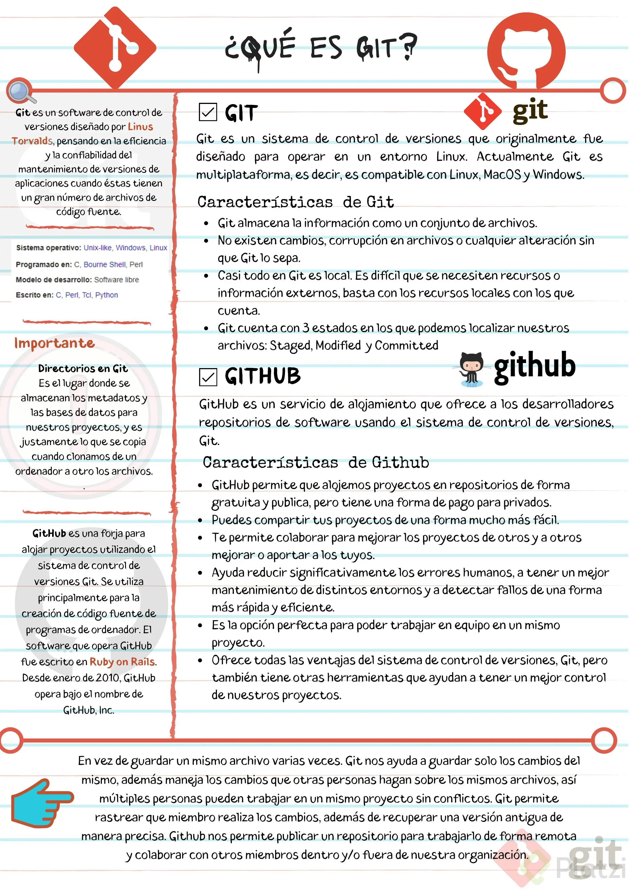
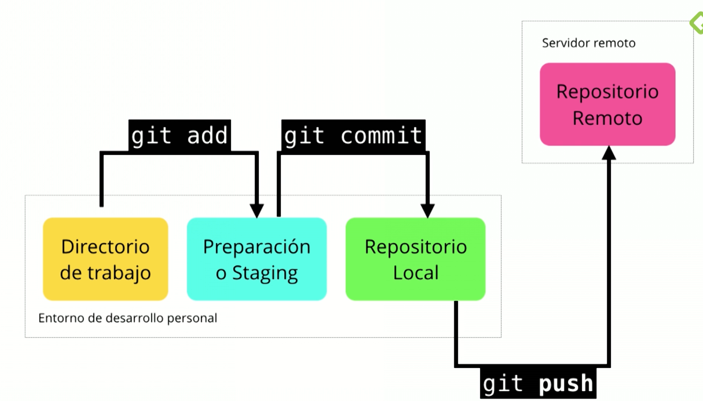
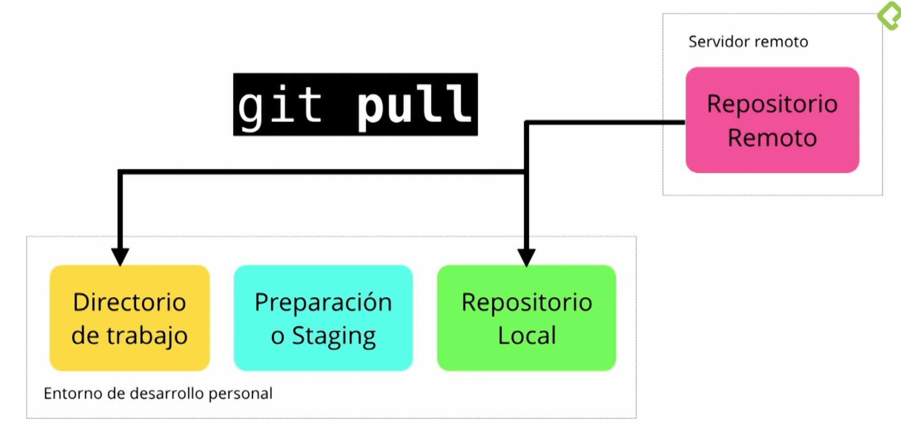
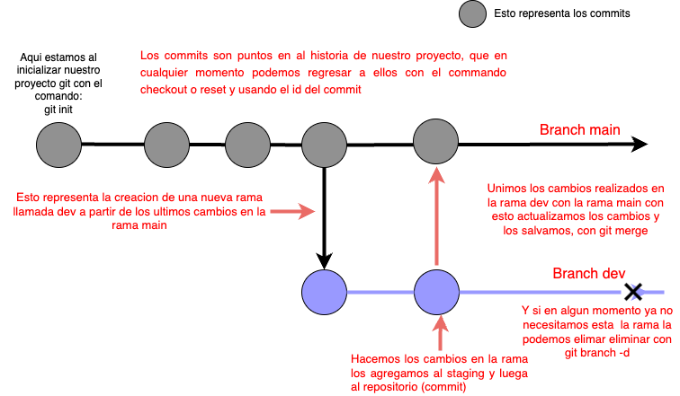

# GIT

[https://github.com/Crisfon6/courseGit](https://github.com/Crisfon6/courseGit)

[Basic commands](README.MD)

Git es un sistema de control de versiones

# Que es un sistema de control de versiones?

*El SCV o VCS (por sus siglas en inglés) es un sistema que registra los cambios realizados sobre un archivo o conjunto de archivos a lo largo del tiempo, de modo que puedas llevar el historial del ciclo de vida de un proyecto, comparar cambios a lo largo del tiempo, ver quién los realizó o revertir el proyecto entero a un estado anterior.*

Cualquier tipo de archivo que se encuentre en un ordenador puede ponerse bajo control de versiones.




# Para que proyectos sirve git?

Con Git se obtiene una mayor eficiencia usando archivos de texto plano, ya que con archivos binarios no puede guardar solo los cambios, sino que debe volver a grabar el archivo completo ante cada modificación, por mínima que sea, lo que hace que incremente demasiado el tamaño del repositorio.

“Guardar archivos binarios en el repositorio de Git no es una buena práctica, únicamente deberían guardarse archivos pequeños (como logos) que no sufran casi modificaciones durante la vida del proyecto. Los binarios deben guardarse en un CDN”.

# Caracteristicas de git

- Git almacena la información como un conjunto de archivos.
- No existen cambios, corrupción en archivos o cualquier alteración sin que Git lo sepa.
- Casi todo en Git es local. Es difícil que se necesiten recursos o información externos, basta con los recursos locales con los que cuenta.
- Git cuenta con 3 estados en los que es posible localizar archivos: Staged, Modified y Committed.

# Git Commands


# Analizar cambios de los archivos

para ver los cambios que a tenido un archivo usamos el command

```bash
git show <filename>
```

Tambien puedes comparar dos commits completos usando el id del commit y el command **diff**

```bash
git diff <id-commit> <id-commit2>
```

 

<aside>
💡 En este punto necesito que vuelvas a repasar todo los anteriores comandos y lecciones vamos a avanzar en el uso diario de git

</aside>

# Funcionamiento parafraseado

Entonces cuando tu inicializas un proyecto git con el commando git init, tenemos 3 entornos de trabajo los cuales son :

- directorio de trabajo (la carpeta de nuestro proyecto)
- Preparacion o Staging (donde se guardan antes de ser mandados al repositorio)
- Repositorio local

para mover nuestros cambios de stage en stage usamos git add  para agregar al staging, git commit para agregar al repositorio, y git push para enviar al repositorio remoto



para traer los cambios que existan en el repositorio remoto usamos git fetch y despues hacemos un git merge, **Existe un comando que une estos en uno solo el cual es : git pull** 



# Branchs

Las branches es la manera que nos ofrece git para trabajar en “espacios” paralelos en el mismo proyecto y hacer aportes a nuestro proyecto de manera incremental y sostenible. Esto consiste en crear un “espacio” “copia” en el cual tu puedes meter los cambios que necesitas y despues de ser probados en esta Branch ser unidos (mergeados) en la rama principal

